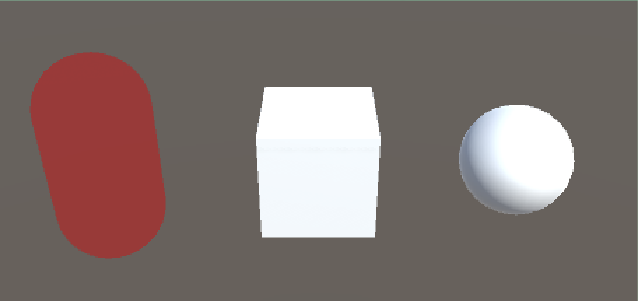
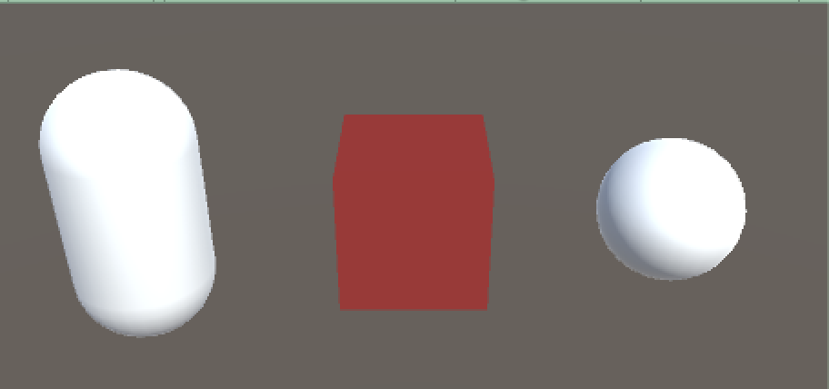
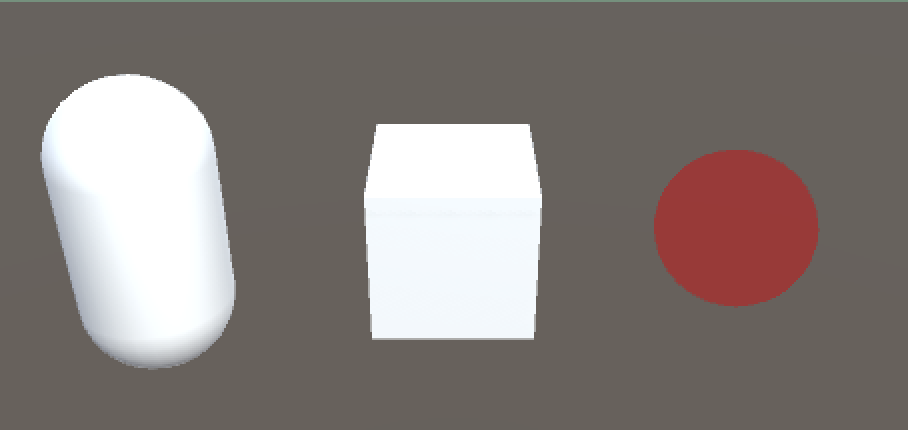

# DebugColliderViewer
Unity Collider Viewer at runtime.


## DEMO




## Usage

```
// Show
DebugColliderViewer.Show(target);

// Hide
DebugColliderViewer.Hide(target);

// Change color
DebugColliderViewer.Color = color;
```


## LICENSE
MIT

## Reference
https://github.com/tomori-hikage/collider-visualizer
